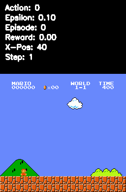

# CITS3001 - Algorithms, Agents and AI Project

### Authors:
- Mitchell Otley (23475725)
- Jack Blackwood (23326698)

#### *Please refer to the project report for breakdown and analysis of the DQNN and OpenCV agents. This README purely describes how to use the agents*

## Create the conda environment
1. Navigate to root directory (where environment.yml file is located)
2. In a conda shell, run `conda env create -f environment.yml`
3. Once environment is created, run `conda activate mario`
4. Follow steps to run the agents from within the environment

## **OpenCV Agent**

**Running the Agent:**
1. Navigate to opencv-agent folder
2. Edit values inside `cv_agent.py` file to change how agent plays 
3. Execute the command:
    ```bash
    python cv_agent.py
    ```

Variables available to change are:
- `CVAgent(debug=[None, 'console', 'detect'])`  
    None - No debugging  
    'console' - Show console messages  
    'detect' - Show detection screen and console messages
  
<div class="row">
  <div class="column">
    
  </div>
  <div class="column">
    
  </div>
</div>

- `agent.STEPS_PER_ACTION`  
    Number of steps taken before another action is chosen

- `agent.GOOMBA_RANGE`  
    Range (in pixels) between Mario and a Goomba before Mario will jump

- `agent.KOOPA_RANGE`  
    Range (in pixels) between Mario and a Koopa before Mario will jump

- `agent.play(metrics=[False, True])`  
    - False - Return `None` when iteration is finished  
    - True - Return a dictionary when iteration is finished:  
            'run-score': total score of iteration,  
            'run-time': time to complete iteration,  
            'steps': steps taken in the iteration 

___
**Run Analysis**

To see an analysis of the experiment data, run `python analysis.py`


## **DDQN Agent**
  <div class="column">
    
  </div>
  <div class="row">
      
## **Train the Model:**

1. Navigate to the `manual_ddqn_agent` folder.
2. Execute the command:
    ```bash
    python main.py [--resume]
    ```
    - The `--resume` flag indicates that we are resuming training from an existing model.
    - Without this flag, a new model will be created and training will start from scratch.

### Configurations:

To influence the training parameters, consider adjusting the following:

- In `main.py`:
  - `episodes`: This defines the total number of episodes to train the model over.

- In `agent.py`:
  ```python
  self.batch_size = 64  # Number of experiences to sample. Options: 32, 48, 64

  self.exploration_rate = 1  # Initial exploration rate for epsilon-greedy policy.
  self.exploration_rate_decay = 0.99999975  # Decay rate for exploration probability.
  self.exploration_rate_min = 0.1  # Minimum exploration rate.

  self.gamma = 0.9  # Discount factor for future rewards. Typically between 0.9 and 0.99.

  self.burnin = 10000  # Number of steps before training begins.

  self.learn_every = 3  # Frequency (in steps) for the agent to learn from experiences.
  self.tau = 0.005  # Rate of soft update for the target network.
  
  self.sync_every = 1.2e4  # Frequency (in steps) to update the target Q-network with the online Q-network's weights.
  self.save_every = 50000  # Frequency (in steps) to save the agent's model.
        `
**Run a Model:**
1. Navigate to manual_ddqn_agent folder
2. Execute the command:
    ```bash
   python replay.py --checkpoint [CHECKPOINT_NAME]
    ```
   - The `--checkpoint` flag asks for an existing .chkpt that we are testing.

This will create a Tester Environment and an additional logging directory. It will attempt to use the specified model with an ``Epsilon`` of `0.1` (Indicating defined action and little to no Exploration)

